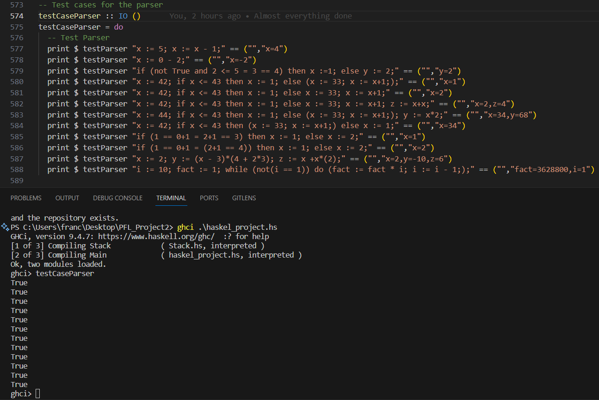
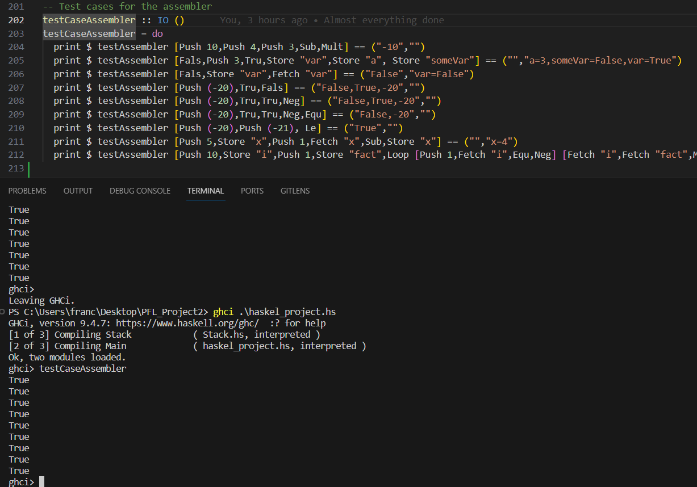

# PFL Project 2

## Introduction
In this project we set out to develop the logic for interpreting and executing instructions considering a low-level machine with configurations of the form (c, e, s) where c is a list of instruction/code, e is the evaluation stack and s is the storage/state.
The following data definitions were also given:

```hs	
data Inst =
  Push Integer | Add | Mult | Sub | Tru | Fals | Equ | Le | And | Neg | Fetch String | Store String | Noop |
  Branch Code Code | Loop Code Code
  deriving Show
type Code = [Inst]
```

## Part I - Assembler
### Stack 
As mentioned above, this project needs a stack structure to store the values resulting from each operation. To do this, we defined our Stack model as shown below, in order to receive a _Value_ that can be of three types: _String_, _Integer_ and _Bool_.
In addition, the basic functions for manipulating a stack have been developed in this model.

```hs
module Stack (Stack, Value (IntValue, StringValue, BoolValue), push, pop, top, empty, isEmpty) where
data Value = IntValue Integer | StringValue String | BoolValue Bool deriving (Show, Eq)
data Stack = Stk [Value] deriving Show
```

### State
In the same way, we structure the state as a list of pairs, the first element of which is the variable (more specifically a String with its name) and the second its value, the latter being of type Value, the same used in the stack.

```hs
type Variable = String
type State = [(Variable, Value)]
```

### Assembler
This part of the project has been broken down into a few functions.
The initial **_run_** function receives the triple _(Code, Stack, State)_, containing the instructions already passed by the **_parser_**, ready to be executed. and an empty stack and state.
When _Code_ is empty, that is, when there are no more instructions to process, it just returns the current state.
In the meantime, a recursive call is made to it, calling the _execute_ function beforehand.

```hs
run :: (Code, Stack, State) -> (Code, Stack, State)
run ([], stack, state) = ([], stack, state)
run (code, stack, state) = run (execute (head code) (tail code, stack, state))
```

The **_execute_** function receives the first instruction of the code to be executed as well as all the remaining information that is passed to the **_run_** function, and returns a new triple _(Code, Stack, State)_.
This is where each instruction is checked to see if it belongs to those initially defined, applying the respective function created for each one, both to the stack and the state, in the respective cases.

```hs
execute :: Inst -> (Code, Stack, State) -> (Code, Stack, State)
execute (Push val) (code, stack, state) = (code, pushN val stack, state)
execute Tru (code, stack, state) = (code, true stack, state)
execute Fals (code, stack, state) = (code, false stack, state)
execute Add (code, stack, state) = (code, add stack, state)
execute Sub (code, stack, state) = (code, sub stack, state)
execute Mult (code, stack, state) = (code, mult stack, state)
execute Equ (code, stack, state) = (code, eq stack, state)
execute Le (code, stack, state) = (code, le stack, state)
execute And (code, stack, state) = (code, myand stack, state)
execute Neg (code, stack, state) = (code, neg stack, state)
execute Noop (code, stack, state) = (code, noop stack, state)
execute (Fetch x) (code, stack, state) = (code, fetchX x stack state, state)
execute (Branch c1 c2) (code, stack, state) = branch c1 c2 code stack state
execute (Loop c1 c2) (code, stack, state) = (c1 ++ [Branch (c2 ++ [Loop c1 c2]) [Noop]] ++ code, stack, state)
execute (Store x) (code, stack, state) = (code, pop stack, storeX x stack state)
execute _ (_, _, _) = error "Run-time error"
```

#### Functions

The function **_pushN_** receives a _Integer_ value and a stack and returns a new stack with the value added to the top.
```hs
pushN :: Integer -> Stack -> Stack
```

The function **_true_** and  **_false_** receives a stack and returns a new stack with the value _True_/_False_ added to the top. They are used to push boolean values to the stack in any circunstance.
```hs
true :: Stack -> Stack
false :: Stack -> Stack
```


The functions **_add_**, **_sub_**, **_mult_** and **_le_** receive a stack and return a new stack with the result of the corresponding operation performed on the top two elements of the stack. They are used to perform arithmetic operations on the top two elements of the stack. They only work with _Integer_ values, otherwise they will return an error. If the stack has less than two elements, it will also return an error too.
```hs
-- Function to add the top two elements of the stack
add :: Stack -> Stack
-- Function to subtract the top two elements of the stack
sub :: Stack -> Stack
-- Function to multiply the top two elements of the stack
mult :: Stack -> Stack
-- Function to compare the top two elements of the stack. If the first is less than or equal to the second, push True to the stack, otherwise push False
le :: Stack -> Stack
```

The function **_eq_** receives a stack and returns a new stack with the result comparing the top two elements of the stack. If they are equal, push True to the stack, otherwise push False. It works for _Integer_ and _Bool_ values. If the stack has less than two elements, it will also return an error too.
- Function to 
```hs
eq :: Stack -> Stack
```

The function **_fetchX_** fetch the value of a given variable from the state, and push it to the stack. If the variable does not exist in the state, it will return an error.
```hs
fetchX :: String -> Stack -> State -> Stack
```

The function **_branch_** receives two codes and a stack and returns a new code, stack and state. If the top of the stack is True, execute the first code, otherwise execute the second code.
```hs
branch :: Code -> Code -> Code -> Stack -> State -> (Code, Stack, State)
```

The function **_storeX_** receives a variable name, a stack and a state and returns a new state with the variable and its value added to the state. If the variable already exists in the state, it will update its value. For that we use the function **_updateValue_** and **_removeValue_**. If the variable does not exist in the state, it will return an error.
```hs
storeX :: String -> Stack -> State -> State
updateValue :: String -> Stack -> State -> State
removeValue :: String -> State -> State
```

The functions **_neg_** and **_myand_** receive a stack and return a new stack with the result of the corresponding operation performed on the top element/two elements of the stack. They are used to perform logical operations on the the stack. They only work with _Bool_ values, otherwise they will return an error. If the stack has less than two elements, it will also return an error too.
```hs
neg :: Stack -> Stack
myand :: Stack -> Stack
```

The function **_noop_** just return the stack without any modification.
```hs
noop :: Stack -> Stack
```


## Part II - Parser

In this part of the project, our goal was to develop the logic for parsing a string and converting it into a list of instructions, which will be used by the assembler to create the code. To do this, we had to develop a compiler, a lexer and a parser.

### Compiler
The compiler is the last stage of the parsing a string, and its function is to receive a program (a list of statements) and return a list of instructions, which will be used by the assembler to create the code. A statement is defined as follows:

```hs
data Stm
  = Assignment Variable Aexp
  | While Bexp [Stm]
  | If Bexp [Stm] [Stm]
  deriving (Show)
```

As it shows, a statement can be composed of two subtypes of expressions, _Aexp_ (Arithmetic Expression) and _Bexp_ (Boolean Expression), which are defined as follows:

```hs
data Aexp
  = IntLiteral Integer
  | Variable Variable
  | Addd Aexp Aexp
  | Subtract Aexp Aexp
  | Multiply Aexp Aexp
  deriving (Show, Eq)
```
It is important to note that in some boolean expressions we have to compile arithmetic expressions (e.g. _Equal_ (==) and _LessOrEqual_ (<=)). Therefore, we had to define an attribute of the data type _Bexp_ that is an _Aexp_.

```hs
data Bexp
  = BoolLiteral Bool
  | Aexp Aexp
  | Equal Bexp Bexp
  | EqualBool Bexp Bexp
  | LessOrEqual Bexp Bexp
  | Nott Bexp
  | Andd Bexp Bexp
  deriving (Show, Eq)
```

A program is defined as a list of statements:

```hs
type Program = [Stm]
```

Then the compiler will receive a list of statements (program) and compile the statements. If the statement is an assignment, it will compile the arithmetic expression and then compile the assignment. If the statement is a while, it will compile the boolean expression and then compile the remaining statements after the _do_. If the statement is an if, it will compile the boolean expression and then compile the remaining statements after the _then_ and _else_, respectively. The compiler is defined as follows:

Main function:

```hs
compile :: [Stm] -> Code
compile = concatMap compileStm
```

Functions to compile a single statement:

```hs
compileStm :: Stm -> Code
compileStm (Assignment var exp) = compA exp ++ [Store var]
compileStm (While cond body) = [Loop (compB cond) (compile body)]
compileStm (If cond bodyTrue bodyFalse) =  (compB cond) ++ [Branch (compile bodyTrue) (compile bodyFalse)]
```

Functions to compile a single arithmetic expression:

```hs
compA :: Aexp -> Code
compA (IntLiteral n) = [Push n]
compA (Variable var) = [Fetch var] 
compA (Addd e1 e2) = compA e2 ++ compA e1 ++ [Add]
compA (Subtract e1 e2) = compA e2 ++ compA e1 ++ [Sub]
compA (Multiply e1 e2) = compA e2 ++ compA e1 ++ [Mult]
```

Functions to compile a single boolean expression:

```hs
compB :: Bexp -> Code
compB (BoolLiteral True) = [Tru]
compB (BoolLiteral False) = [Fals]
compB (Equal e1 e2) = compB e2 ++ compB e1 ++ [Equ]
compB (EqualBool e1 e2) = compB e2 ++ compB e1 ++ [Equ]
compB (LessOrEqual e1 e2) = compB e2 ++ compB e1 ++ [Le]
compB (Nott b) = compB b ++ [Neg]
compB (Andd b1 b2) = compB b2 ++ compB b1 ++ [And]
compB (Aexp e) = compA e
```

### Lexer
The lexer is the first part of the parser, and its function is to receive a string and return a list of tokens, which will be used by the parser to create the code. The tokens are defined as follows:

```hs
data Token
  = PlusTok
  | MinusTok
  | TimesTok
  | OpenP
  | CloseP
  | IntTok Integer
  | VarTok Variable
  | BoolTok Bool
  | AssignTok
  | SemicolonTok
  | IfTok
  | ThenTok
  | ElseTok
  | WhileTok
  | DoTok
  | NotTok
  | AndTok
  | EqATok
  | EqBoolTok
  | LeTok
  deriving (Show)
```

These tokens will then be used by the lexer to create the list of tokens, matching the current string word being analyzed with the tokens defined above. The lexer is defined as follows:

```hs
lexer :: String -> [Token]
lexer [] = []
lexer ('+' : restStr) = PlusTok : lexer restStr
lexer ('-' : restStr) = MinusTok : lexer restStr
lexer ('*' : restStr) = TimesTok : lexer restStr
lexer ('(' : restStr) = OpenP : lexer restStr
lexer (')' : restStr) = CloseP : lexer restStr
lexer (';' : restStr) = SemicolonTok : lexer restStr
lexer (':':'=' : restStr) = AssignTok : lexer restStr
lexer ('i':'f' : restStr) = IfTok : lexer restStr
lexer ('t':'h':'e':'n' : restStr) = ThenTok : lexer restStr
lexer ('e':'l':'s':'e' : restStr) = ElseTok : lexer restStr
lexer ('w':'h':'i':'l':'e' : restStr) = WhileTok : lexer restStr
lexer ('d':'o' : restStr) = DoTok : lexer restStr
lexer ('n':'o':'t' : restStr) = NotTok : lexer restStr
lexer ('a':'n':'d' : restStr) = AndTok : lexer restStr
lexer ('=':'=' : restStr) = EqATok : lexer restStr
lexer ('=' : restStr) = EqBoolTok : lexer restStr
lexer ('<':'=' : restStr) = LeTok : lexer restStr
lexer ('T':'r':'u':'e' : restStr) = BoolTok True : lexer restStr
lexer ('F':'a':'l':'s':'e' : restStr) = BoolTok False : lexer restStr

lexer (chr : restStr)
  | isSpace chr = lexer restStr
  | isAlpha chr && isLower chr = VarTok (chr : takeWhile (\c -> c `notElem` reservedSymbols) restStr) : lexer (dropWhile (\c -> c `notElem` reservedSymbols) restStr)
  where
    reservedSymbols = "+-*();:=<> "

lexer str@(chr : _)
  | isDigit chr
  = IntTok (stringToInt digitStr) : lexer restStr
  where
    (digitStr, restStr) = break (not . isDigit) str
    -- convert a string to an integer
    stringToInt :: String -> Integer
    stringToInt=foldl (\acc chr->10*acc+(toInteger (digitToInt chr))) 0
  -- runtime error:
lexer (chr : restString)
  = error ("unexpected character: '" ++ show chr ++ "'")
```

As it shows, the lexer will receive a string and analyze it character by character, creating the list of tokens. It is important to note that the lexer will ignore spaces.

For example the string "x := 2 + 3" will be converted to the list of tokens [VarTok "x", AssignTok, IntTok 2, PlusTok, IntTok 3].

If the lexer receives a character that is not part of the language (e.g, a variable name starting with an uppercase letter), it will return an error.

### Parser

The parser is the second part of parsing a string and its function is to receive a list of tokens and return a list of statements, which will be used by the compiler to create the code. The parser has mainly 3 parts:

1. Parsing arithmetic expressions
2. Parsing boolean expressions
3. Parsing statements

Both the parsing of arithmetic expressions and the parsing of boolean expressions follow a cascade logic, where the precedence of the operators is taken into account. For example, the expression "2 + 3 * 4" will be parsed as "2 + (3 * 4)", since the function that parses the multiplication is called after the function that parses addition, but due to recursion, the result of the parsing will be completed before the addition.

So, if we want a different precedence, we just have to change the order of the functions in the cascade (for example, the multiplication function calling the addition function).

#### Parsing arithmetic expressions

The parsing of arithmetic expressions is done by the function **_parseSubOrSumOrProdOrIntOrPar_**. It receives a list of tokens and returns a tuple containing the arithmetic expression and the remaining tokens. 

```hs
-- Function to parse integer or parenthesized tokens into an arithmetic expression
parseIntOrParenExpr :: [Token] -> Maybe (Aexp, [Token])

-- Function to parse a multiplication into an arithmetic expression. It can also parse the same tokens of the arithmetic parsers above
parseProdOrIntOrPar :: [Token] -> Maybe (Aexp, [Token])

-- Function to parse a subtraction or sum into an arithmetic expression. It can also parse the same tokens of the arithmetic parsers above
parseSubOrSumOrProdOrIntOrPar :: [Token] -> Maybe (Aexp, [Token])
```

#### Parsing boolean expressions

The parsing of boolean expressions is done by the function **_parseAndOrEqBOrNotOrEqAOrLeOrBoolOrPar_**. It receives a list of tokens and returns a tuple containing the boolean expression and the remaining tokens. 

```hs
-- Function that parses an arithmetic expression. It is used to parse the arithmetic expressions inside the boolean expressions
parseAexp :: [Token] -> Maybe (Aexp, [Token])

-- Function to parse boolean or parenthesized tokens into a boolean expression
parseBoolOrParenExpr :: [Token] -> Maybe (Bexp, [Token])

-- Function to parse a boolean expression with an arithmetic expression. It can also parse the same tokens of the boolean parsers above
parseAexpOrBoolOrParenExpr :: [Token] -> Maybe (Bexp, [Token])

-- Function to parse an inequality (<=) into a boolean expression. It can also parse the same tokens of the boolean parsers above
parseLeOrBoolOrPar :: [Token] -> Maybe (Bexp, [Token])

-- Function to parse an arithmetic equality (==) into a boolean expression. It can also parse the same tokens of the boolean parsers above
parseEqAOrLeOrBoolOrPar :: [Token] -> Maybe (Bexp, [Token])

-- Function to parse a negation (not) into a boolean expression. It can also parse the same tokens of the boolean parsers above
parseNotOrEqAOrLeOrBoolOrPar :: [Token] -> Maybe (Bexp, [Token])

-- Function to parse a boolean equality (=) into a boolean expression. It can also parse the same tokens of the boolean parsers above
parseEqBOrNotOrEqAOrLeOrBoolOrPar :: [Token] -> Maybe (Bexp, [Token])

-- Function to parse an and (and) into a boolean expression. It can also parse the same tokens of the boolean parsers above
parseAndOrEqBOrNotOrEqAOrLeOrBoolOrPar :: [Token] -> Maybe (Bexp, [Token])
```

As explained earlier, in this case the order of precedence of the operators is:

1. Parentheses
2. Inequality (<=)
3. Arithmetic equality (==)
4. Negation (not)
5. Boolean equality (=)
6. And (and)

#### Parsing statements

Finally, the parsing of statements is done by the function **_parseStatements_**. It receives a list of tokens and returns a tuple containing the list of statements and the remaining tokens. This function has a subfunction called **_parseStatement_** that receives a list of tokens and returns a tuple containing a statement and the remaining tokens. This function is used to parse assignements, whiles and ifs.

```hs
parseStatements :: [Token] -> Maybe (Program, [Token])
parseStatement :: [Token] -> Maybe (Stm, [Token])
```

Finally, the parser is defined as follows:

```hs
parser :: [Token] -> Program
parser tokens =
  case parseStatements tokens of
    Just (expr, []) -> expr
    _ -> error "Parser error"
```

As it shows, the parser will receive a list of tokens and call the function **_parseStatements_**. If the parsing is successful (no more tokens to be read), it will return the list of statements, otherwise it will return an error.

The **lexer** and the **parser** are combined in the function **_parse_**. It receives a string and returns a Program.

```hs
parse :: String -> Program
parse main_code = parser (lexer main_code)
```

## Execution Examples
### Given Examples

.

### Our Examples
```hs
-- Example 1
ghci> testParser "x:=0; if (True = 1+2<=5+1) then (y:=4; z:=2; x:= y*z;) else while x == 0 do (x:=5;);"
("","x=8,y=4,z=2")
-- Example 2
ghci> testParser "x:=0; i:=2; j:=2; while not i==0 do(while not j==0 do(x:=x+1; j:=j-1;); j:=2; i:=i-1;);"
("","i=0,j=2,x=4")
-- Example 3
ghci> testParser "x:=0; if (False = 1+2<=5+1) then (y:=4; z:=2; x:= y*z;) else while x == 0 do (x:=5;);"  
("","x=5")
-- Example 4
ghci> testParser "(x:=0; y:=1;); if y==1 then z:=0-1; else a:=x+1;"
("","x=0,y=1,z=-1")
-- Example 5
ghci> testParser "(x:=0; y:=1;); if y==0-1 then z:=0-1; else a:=x+1;"
("","a=1,x=0,y=1")
```


## Contributuion
This project was developed by:
 - Francisco Campos (up202108735) -> 50%
 - Henrique Pinheiro (up202108879) -> 50%
